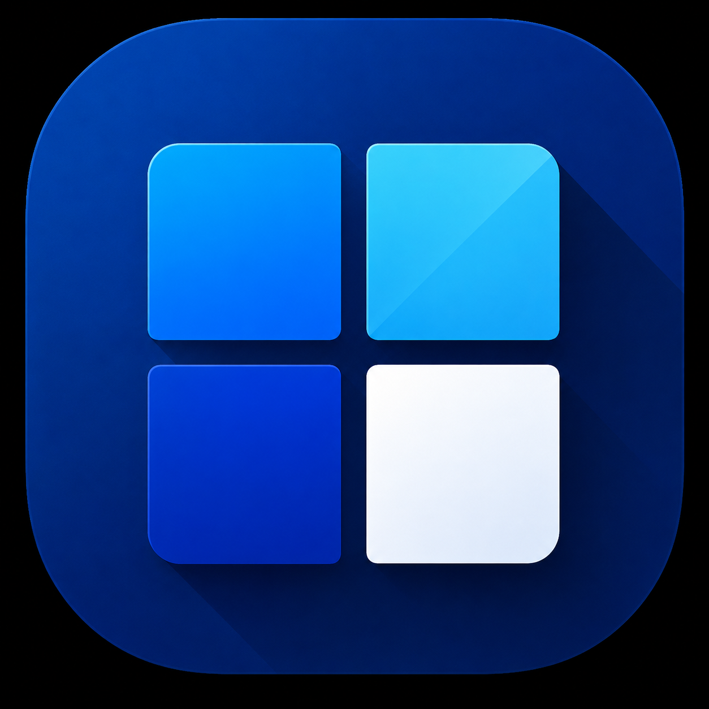
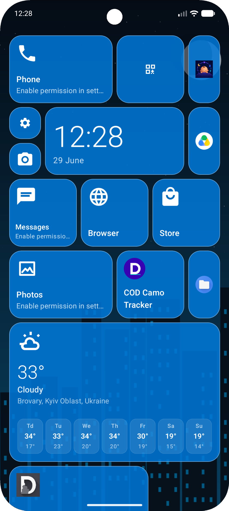
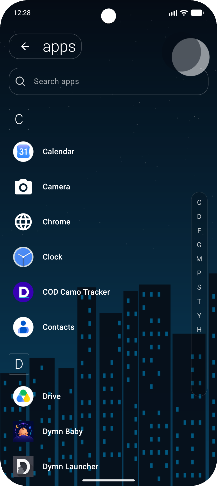
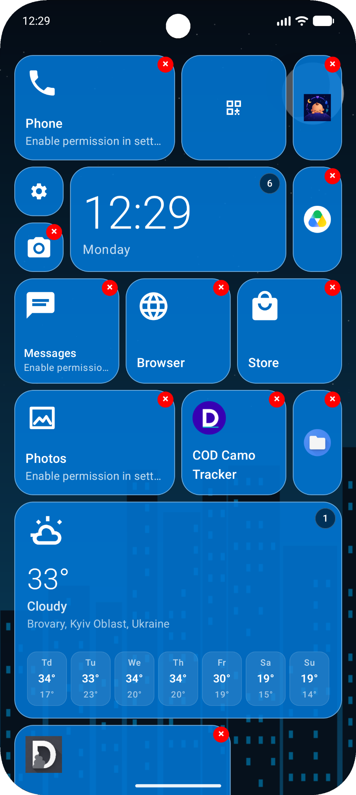
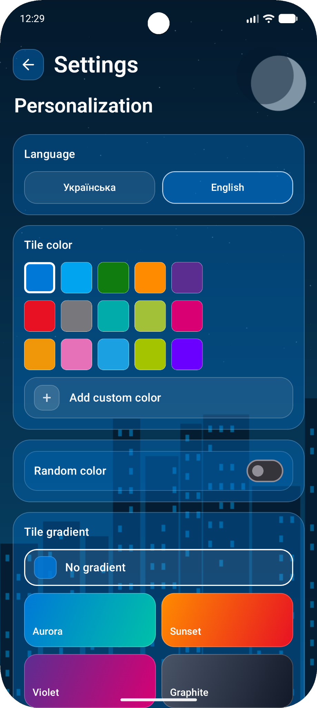
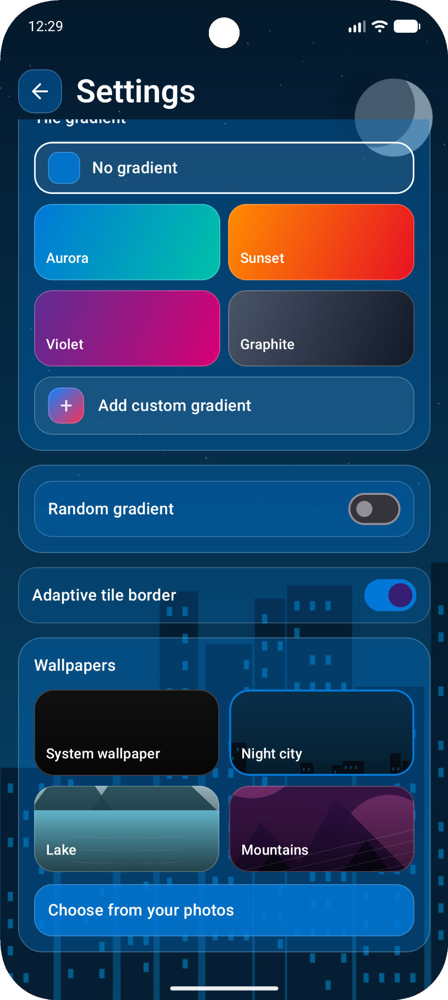
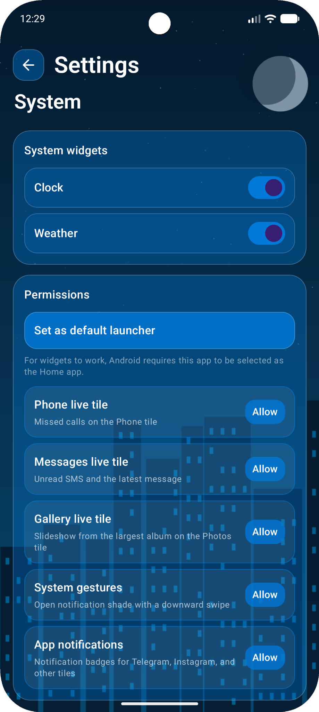

# Metro Launcher 🟦

<p align="center">
  
</p>

<h1 align="center">Metro Launcher</h1>

<p align="center">
A highly customizable Metro / Windows Phone inspired Android launcher featuring Live Tiles, widgets, icon pack support, wallpapers, gradients, notification badges, and deep personalization built with Kotlin and Jetpack Compose.
</p>

<p align="center">


</p>

---

# 📖 Contents

* Features
* Demo
* Screenshots
* Tech Stack
* Roadmap
* Installation
* License

---

# ✨ Features

* 🟦 Metro / Windows Phone inspired UI
* 🏠 Fully customizable home screen
* 📐 Resizable Live Tiles
* 📦 Android widget support
* 🌦 Weather widget
* 🕒 Clock widget
* 🔔 Notification badges
* 🎨 Tile color customization
* 🌈 Gradient tiles
* 🖼 Built-in wallpapers
* 📷 Custom wallpapers
* 🎭 Icon Pack support
* 👆 Gesture support
* 🔍 Fast app search
* 🔤 Alphabetical app navigation
* 🌍 Multi-language support
* ⚡ Built with Jetpack Compose

---

## 🎬 Demo

### 🏠 Home Screen


---

### 📱 App Drawer


---

### ⚙️ Settings & Personalization


---

### 🧩 Widgets


# 📱 Screenshots

<h3 align="center">🏠 Home Screen</h3>

<p align="center">

</p>

<h3 align="center">📋 App Drawer</h3>

<p align="center">

</p>

<h3 align="center">✏️ Edit Mode</h3>

<p align="center">

</p>

<h3 align="center">🎨 Personalization</h3>

<p align="center">

</p>

<h3 align="center">🌈 Gradients & Wallpapers</h3>

<p align="center">

</p>

<h3 align="center">⚙️ System Settings</h3>

<p align="center">

</p>

---

# 🛠 Tech Stack

* Kotlin
* Jetpack Compose
* Material Design 3
* Android SDK
* Android Widget API
* PackageManager
* SharedPreferences

---

# 🗺 Roadmap

## ✅ Completed

* Metro style launcher
* Live Tiles
* Tile resizing
* Android widgets
* Clock widget
* Weather widget
* Notification badges
* Icon Pack support
* Wallpaper manager
* Tile colors
* Tile gradients
* Custom gradients
* Custom wallpapers
* Gesture support
* Search
* Alphabet navigation
* Multi-language support
* Launcher registration
* Material Design 3
* Jetpack Compose UI

## 🚧 Planned

* Backup & Restore
* Tablet layout optimization
* Additional Live Tile integrations
* More animations and transitions

---

# 🚀 Installation

```bash
git clone https://github.com/DymnStudio/DymnMetro.git
```

Open the project in Android Studio and run it on an Android device or emulator.

To unlock all features:

* Set Metro Launcher as your default Home application.
* Grant notification access.
* Allow widget permissions.
* Enable Phone and Messages permissions for Live Tiles.

---

# 📄 License

This project is licensed under the MIT License.

See the **LICENSE** file for more information.
